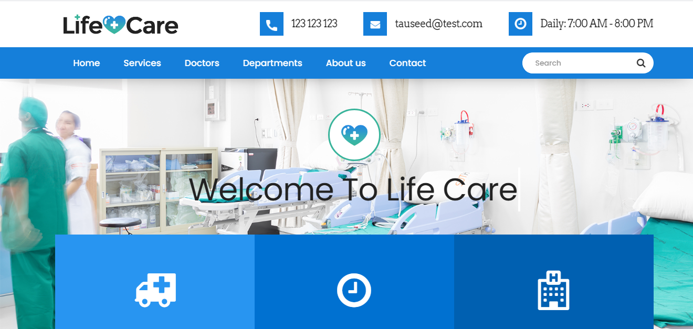
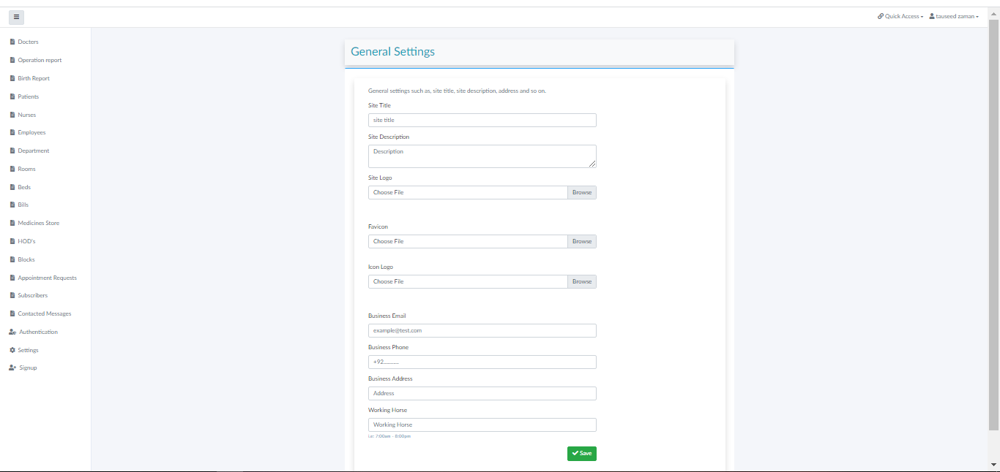

# Metro Hospital Management System (HMS)

A compact, role-based Hospital / Clinic management system built with **Laravel 12** and **Livewire 3**.
It ships with a dynamic public website, online appointment booking, meeting & calendar management,
a leave approval workflow, notifications, and clinical modules — all driven by a super-admin panel.




---

## Highlights

- **Clinic / Hospital modes** — the super admin switches the whole institution between
  *Clinic* (admin, receptionist, doctor, pharmacist only) and *Multi-Speciality Hospital*
  (every role and module) from **Admin → Settings**. The sidebar, logins and permissions adapt automatically.
- **Dynamic public website** — title, tagline, logo, hero image, hero/about/emergency copy, working
  hours and social links are all editable from the admin panel (no code changes needed).
- **Online appointment booking** — patients request an appointment from the landing page; the front
  desk reviews and converts requests into patients/appointments in the admin panel.
- **Meetings & calendar** — create meetings, invite participants, accept/decline responses, with
  automatic notifications.
- **Leave workflow** — staff submit leave; moderators/HR review and approve or reject with a note.
- **Notification bell** — live in-app notifications for meeting invites and leave status changes.
- **Clinical modules** — appointments, prescriptions, patient history, discharge history, expiry
  monitoring, operations, births, rooms/beds and billing.
- **Compact, consistent UI** — tight spacing, small controls and smooth transitions across admin
  and public pages.

---

## Roles

| Role | Scope |
| --- | --- |
| Admin (super admin) | Full control: settings, staff, all modules, institution mode |
| Moderator (Dean) | Oversees departments, staff, leave review, meetings; no system settings |
| Doctor | Patients, appointments, prescriptions, history, operations, births |
| Nurse | Patient care, beds/rooms, history |
| Receptionist | Patient registration, appointments, messages |
| Pharmacist | Medicine store, expiry, prescriptions |
| Laboratorist | Patient history / diagnostics |
| Accountant | Billing and payments |
| Store Keeper | Medicines, expiry, blocks |
| HR Manager | Employees, staff, departments, leave review |

In **Clinic mode** only `admin`, `receptionist`, `doctor` and `pharmacist` can sign in; the
hospital-only modules (in-patient, operations, births, discharge, departments, employees, HODs,
nurses) are hidden and blocked.

---

## Tech Stack

- PHP 8.2+, Laravel 12
- Livewire 3
- MySQL / MariaDB
- Bootstrap 3 + AdminLTE styling, Font Awesome, Flaticon

---

## Installation

### Prerequisites

- PHP >= 8.2
- Composer
- MySQL / MariaDB
- Node.js + npm (only for asset builds)

### Steps

```bash
git clone <your-repository-url> hospitalms
cd hospitalms

composer install
npm install && npm run build   # optional, assets are committed

cp .env.example .env
php artisan key:generate
```

Configure your database in `.env`:

```env
DB_CONNECTION=mysql
DB_HOST=127.0.0.1
DB_PORT=3306
DB_DATABASE=hms
DB_USERNAME=root
DB_PASSWORD=
```

```bash
php artisan storage:link
php artisan migrate --seed
php artisan serve
```

Open <http://127.0.0.1:8000>.

> The application can also run from a sub-path / custom port (e.g. `php artisan serve --port=8100`).

---

## Demo Accounts

All seeded demo accounts use the password **`123456`**.

| Role | Email |
| --- | --- |
| Admin | `azim@hms.com` |
| Moderator (Dean) | `mod@hms.com` |
| Doctor | `doc@hms.com` |
| Nurse | `nurse@hms.com` |
| Receptionist | `recep@hms.com` |
| Pharmacist | `pharma@hms.com` |
| Laboratorist | `lab@hms.com` |
| Store Keeper | `store@hms.com` |
| HR Manager | `hr@hms.com` |
| Accountant | `accountant@gmail.com` |

Public website: `/` · Admin login: `/admin`

---

## Switching Clinic / Hospital Mode

1. Sign in as the super admin (`azim@hms.com`).
2. Go to **Settings**.
3. Choose **Institution Mode** → `Clinic` or `Multi-Speciality Hospital`.
4. Save. Logins, sidebar entries and module access update immediately.

---

## Project Structure (key files)

```
app/
  helpers.php                     # storage_url(), hms_can(), institution-mode helpers, sidebar tree
  Http/Livewire/
    Appointmentform.php           # public online booking
    Admins/
      Settings.php                # dynamic site + institution mode
      MeetingCalendar.php         # meetings, invites, responses
      LeaveRequests.php           # leave submit / review / decide
      NotificationBell.php        # navbar notifications
      StaffDirectory.php          # role-filtered staff
      Appiontment.php             # appointment CRUD
      Prescriptions.php, PatientHistory.php, DischargeHistory.php, ExpiredMedicines.php ...
config/hms.php                    # roles + modules + clinic/hospital mode definitions
resources/views/
  index.blade.php                 # compact dynamic landing page
  layouts/app.blade.php           # public layout (dynamic branding)
  livewire/ ...                   # component views
public/css/custom.css             # public + landing compact theme
public/assets/css/master.css      # admin compact theme
```

---

## Testing

The project is verified with:

- Authenticated HTTP smoke tests across every admin route.
- Livewire component tests (CRUD, filters, permissions, workflows) using rolled-back fixtures.
- A Puppeteer audit over 31 public + admin pages checking layout overflow, loaded stylesheets,
  icon fonts, broken images and console errors.

---

## License

Released under the MIT License. Originally based on
[tauseedzaman/hospitalMS](https://github.com/tauseedzaman/hospitalMS).
